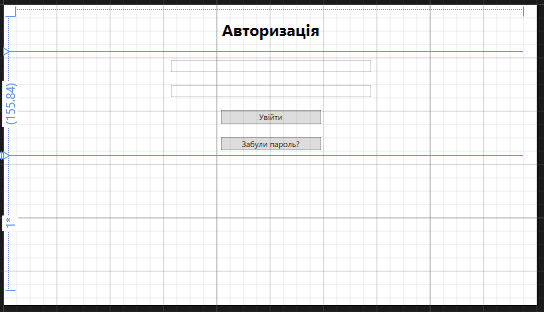
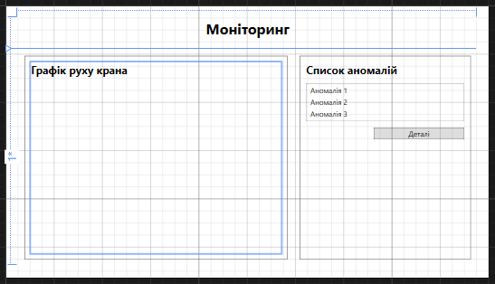
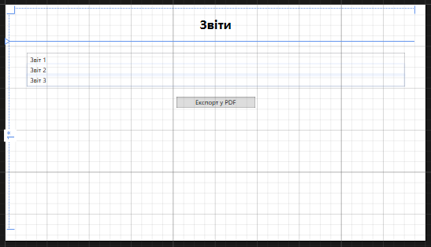

# Проект макету

## NFR_1: Екран авторизації  
Основне вікно для входу користувача в систему:

- **Елементи інтерфейсу:**
  - Поле для введення логіну.
  - Поле для введення пароля.
  - Кнопка **"Увійти"** — дозволяє перейти до головного екрану після успішної авторизації.
  - Кнопка **"Забули пароль?"** — перенаправляє на екран відновлення паролю.
- **Додаткові функції:**
  - Відображення повідомлення про помилку, якщо введені дані некоректні.
  - Валідація полів введення (логін та пароль є обов’язковими).

---

## NFR_2: Екран моніторингу  
Основний екран для перегляду стану крана та аномалій:

- **Елементи інтерфейсу:**
  - **Графік руху крана:** Відображення параметрів (швидкість, нахил) у реальному часі.
  - **Список аномалій:** Таблиця з переліком активних аномалій із зазначенням дати, опису та статусу.
  - Кнопка **"Деталі"** — дозволяє переглянути додаткову інформацію про вибрану аномалію.
- **Додаткові функції:**
  - Оновлення графіків та списку аномалій у реальному часі.
  - Інтерактивність таблиці (вибір рядка активує кнопку "Деталі").

---

## NFR_3: Екран звітів  
Екран для роботи з історією даних та генерацією звітів:

- **Елементи інтерфейсу:**
  - **Список звітів:** Перелік доступних звітів із зазначенням назви та дати створення.
  - Кнопка **"Переглянути"** — відкриває детальний перегляд вибраного звіту.
  - Кнопка **"Експорт у PDF"** — дозволяє завантажити звіт у форматі PDF.
  - Кнопка **"Експорт у CSV"** — дозволяє завантажити звіт у форматі CSV.
- **Додаткові функції:**
  - Пошук і сортування звітів за датою або назвою.
  - Автоматичне створення архіву звітів у базі даних.

